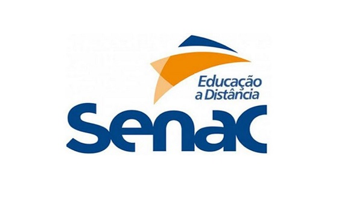

:toc: left
:sectnums:
:sectnumlevels: 5
:toc-title: Sumário
:toclevels: 5
:icons: font
:homepage: https://www.linkedin.com/alan.aasilver
:author: Alan de Araujo Silveira
:email: alan.aasilver@gmail.com
:curso: EGGTICASDA-2021-681599
:revision: 1.0
:date: 09/04/2021
:title-page-background-image: 
:title-logo-image: 
:appendix-caption: Anexo

= AVALIAÇÃO DE DISCIPLINA

[preface]
==  GOVERNANÇA E ESTRATÉGIA DE TI

[preface]
=== QUESTÕES E RESPOSTAS

* Questão 01: Diante do cenário ocorrido no banco Panamericano, quais foram as principais falhas no processo de governança corporativa?
** Resposta: Considerando que o banco contava com um comitê de auditoria e conselho fiscal; Considerando que o banco foi auditado externamente por uma das maiores empresas do ramo (Deloitte) e pela KPMG durante a avaliação feita pelo Banco Factor; Considerando que os executivos estavam diretamente envolvidos com a esquema de corrupção; Considerando que o banco prestou informações aos órgãos de supervisão e de fiscalização e que essas informações eram geradas e aprovadas pela própria diretoria do banco; Fica evidente que os processos de governança eram existentes, mas sujeitos às influências das partes interessadas, tornando-os frágeis. Desse modo, acredito que a fragilidade do processo EDM05 (Garantir a transparência para as partes interessadas), dificultou tando a prestação de contas quanto a identificação das oportunidades de correções e de melhorias.

* Questão 02: Em um comitê de auditoria do banco Panamericano, cite ao menos cinco (5) itens que poderiam estar incluídos e sendo discutidos.
** Resposta: O https://ri.bancopan.com.br/faq/comite-de-auditoria/[COMITÊ DE AUDITORIA] do banco Panamericano ou banco Pan, como é atualmente chamado, foi criado em 11/08/2008. Em seu https://ri.bancopan.com.br/wp-content/uploads/sites/85/2018/07/Panamericano_Regimento_Interno_Comite_Auditoria_20090217.pdf[REGIMENTO INTERNO] constam descritos os objetivos e as competências do referido comitê. Se comparado ao https://mz-prod-cvm.s3.amazonaws.com/1023/IPE/2019/d210d3cd-8bf8-4680-a11e-3cf70b651feb/20190815173913794158_1023_706521.pdf[REGIMENTO INTERNO] do https://ri.bb.com.br/governanca-e-sustentabilidade/comites/[COMITÊ DE AUDITORIA] do Banco do Brasil, percebemos que tais atribuições são muito parecidas. Com o objetivo de enriquecer uma possível discussão sobre o tema, cito os seguintes itens: relatório onde conste a inobservância de normas legais e regulamentares que coloquem em risco a continuidade da instituição; relatório onde conste fraudes perpetradas por dirigentes; relatório onde conste fraudes perpetradas por funcionários ou terceiros; relatórios onde constem erros nas demonstrações contábeis; relatórios onde conste divergências entre as auditorias interna e independente; e relatórios relativos às atividades de ouvidoria em que observe ocorrências relevantes. Tais itens, constam no regimento interno do BB e são observados no Artigo 3º, todos do §2º.

* Questão 03: Durante toda a situação observada muito se falou de vazamento de dados e colocou-se a segurança da informação em cheque. Diante desse cenário, quais seriam as boas práticas a serem observadas e monitoradas internamente?
** Resposta: 
